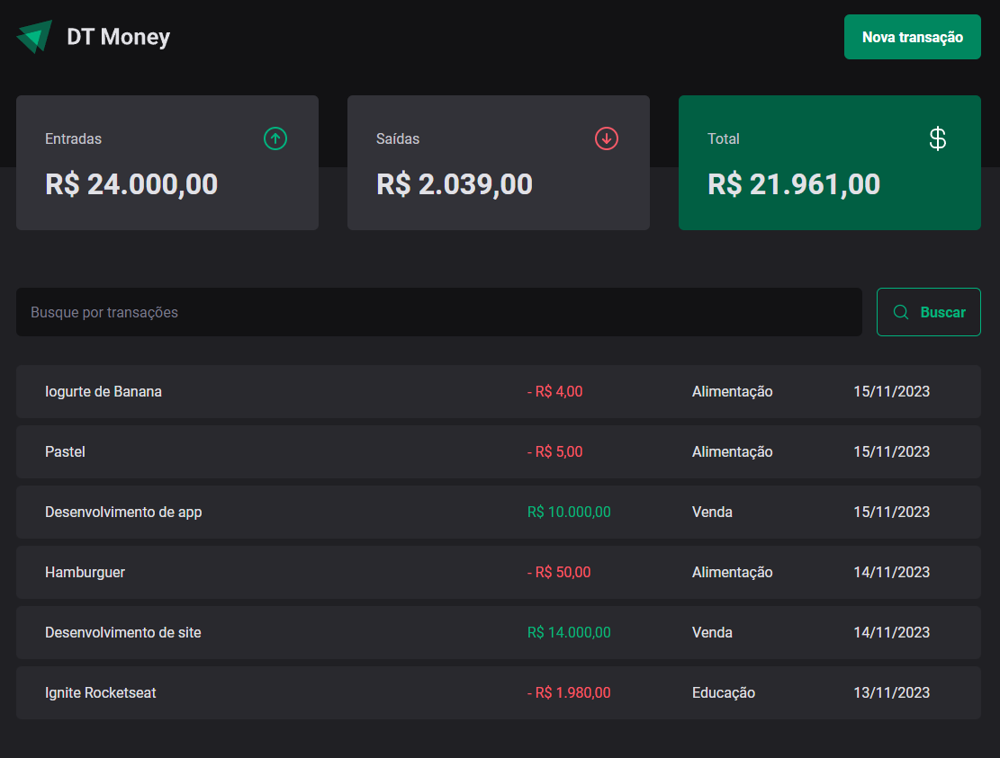

# DTMoney

DT Money is a web application dedicated to managing your financial life seamlessly. Easily log your expenses and income, categorize transactions, and gain insights into your financial activities. The application provides a concise summary of expenses, income, and the overall total at the top of the page. Additionally, it includes a search functionality for quick and efficient navigation.

## Key Features

Expense and Income Tracking: Log and categorize your financial transactions.
Summary Overview: View a comprehensive summary of expenses, income, and total balance at the top of the page.
Search Functionality: Easily search and locate specific transactions.

## Technologies Used

This project was developed as part of the React specialization at Rocketseat, leveraging the following technologies:

- React
- TypeScript
- Styled-components
- Radix UI
- Zod
- Getting Started
- To explore DT Money, follow these steps:

## How to Contribute
If you'd like to contribute to DT Money, follow these steps:

1. Fork the repository on GitHub.
2. Clone your fork locally.
3. Create a new branch for your feature or bug fix.
4. Make your changes and commit them with descriptive messages.
5. Push your changes to your fork.
6. Submit a pull request to the main repository.

## Acknowledgments
This project was crafted with passion and dedication during the React specialization at Rocketseat.
Feel free to explore the application, and your feedback and contributions are highly appreciated!
 
 
_________________________
<!-- <small> -->
   made with ❤️ by
   [brunaporato](https://www.linkedin.com/in/brunaporato)
<!-- </small> -->